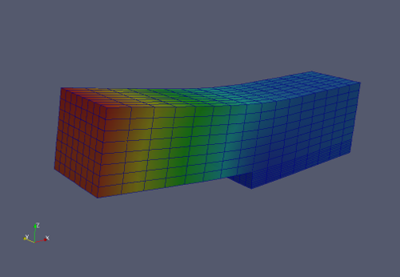

.. _example-elastostatics:

Elastostatics
=============

This example show how to solve very simple elastostatic problem.

Mesh is defined:

   TODO

Boundary conditions:

   TODO

Equations are:

.. math::
   :nowrap:

   \begin{eqnarray*}
   \int_\Omega
   (2\mu + \lambda)\dd{u_1}{x}\dd{v_1}{y} + \mu \dd{u_1}{y}\dd{v_1}{y} + \mu \dd{u_1}{z}\dd{v_1}{z} +
   \lambda \dd{u_2}{y}\dd{v_1}{x} + \mu \dd{u_2}{x}\dd{v_1}{y} +
   \lambda \dd{u_3}{z}\dd{v_1}{x} + \mu \dd{u_3}{x}\dd{v_1}{z}
   &= \displaystyle\int_{\Gamma_3} f_1 v_1 dS \\
   \int_\Omega
   \mu \dd{u_1}{y}\dd{v_2}{x} + \lambda \dd{u_1}{x}\dd{v_2}{y} +
   \mu \dd{u_2}{x}\dd{v_2}{x} + (2\mu + \lambda)\dd{u_2}{y}\dd{v_2}{y} + \mu \dd{u_2}{z}\dd{v_2}{z} +
   \lambda \dd{u_3}{z}\dd{v_2}{y} + \mu \dd{u_3}{y}\dd{v_2}{z}
   &= \displaystyle\int_{\Gamma_3} f_2 v_2 dS \\
   \int_\Omega
   \mu \dd{u_1}{z}\dd{v_3}{x} + \lambda \dd{u_1}{x}\dd{v_3}{z} +
   \mu \dd{u_2}{z}\dd{v_3}{y} + \lambda \dd{u_2}{y}\dd{v_3}{z} +
   \mu \dd{u_3}{x}\dd{v_3}{x} + \mu \dd{u_3}{y}\dd{v_3}{y} + (2\mu + \lambda)\dd{u_3}{z}\dd{v_3}{z}
   &= \displaystyle\int_{\Gamma_3} f_2 v_2 dS
   \end{eqnarray*}

Result:

.. literalinclude:: ../../examples/elastostatics/main.cc
   :language: c
   :linenos:
   :lines: 19-

